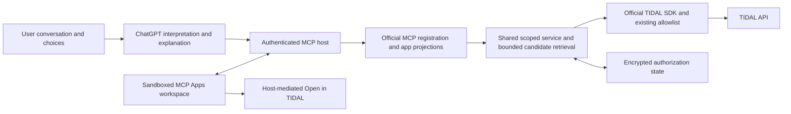

# ChatGPT music discovery with TIDAL — feature specification

**Status:** Research complete; conditional specification; not yet planned, frozen, implemented, or release-approved.

**Date:** 1 October 2026, Asia/Singapore.

**Dependencies:** Existing MCP/OAuth/MCP Apps implementation, TIDAL permission, intended ChatGPT account eligibility.

**Layer:** Product experience, protocol integration, account isolation.

**Priority:** Permission and eligibility before live expansion; discovery experience before write features.

**Complexity:** Moderate product work with material authorization/operations dependencies; task count awaits planning.

Normative MUST requirements are the intended acceptance contract for this feature. Proposed numeric limits are application choices, not TIDAL or ChatGPT limits. The existing root `SPEC.md` remains the baseline contract. Source references and provenance are in [research.md](research.md).

## 1. Executive summary

Build a music exploration experience inside ChatGPT using the existing MCP server and portable MCP Apps UI. ChatGPT interprets the user's preferences and discusses retrieved candidates; this server retrieves bounded, authorized data and evidence. Users connect their own TIDAL accounts through OAuth. The service holds TIDAL tokens; neither ChatGPT nor the component receives them.

The first release supports favourite-track exploration, optional saved-music sampling, related artist/release browsing, and a session shortlist with Open in TIDAL actions. It does not modify TIDAL playlists or saved collections. It requires no separate server-side LLM provider, vector store, or audio analysis.

**G0 — TIDAL permission:** Before new live AI use, obtain written authorization covering the actual ChatGPT integration, catalogue metadata, optional private library data, model processing, host retention, and intended distribution. The published Developer Terms II.1.19–20 restrict AI use; Developer Guidelines III.7 places AI offerings among uses requiring express written approval. Account OAuth, a personal subscription, read-only operation, and no-training settings do not establish that authorization. No such approval was provided for this research. [TIDAL Terms](https://developer.tidal.com/documentation/guidelines/guidelines-developer-terms), [TIDAL Guidelines](https://developer.tidal.com/documentation/guidelines/guidelines-developer-guidelines)

**G1 — public eligibility:** A public listing additionally requires resolution of OpenAI's rule on primarily unofficial connectors, appropriate TIDAL production/distribution permission, and the intended publisher's eligibility. Adding a UI does not demonstrate eligibility. Private developer-mode testing and public publication are separate gates; neither is performed by this specification. [OpenAI guidelines](https://developers.openai.com/plugins/plugin-guidelines)

The announcement supplied by the user establishes the conversational-app direction. Current developer documentation uses Plugins terminology and documents MCP with optional UI. The product remains described here as a ChatGPT app; implementation must follow the current protocol and portal rather than assume the announcement's original submission process. [Announcement](https://openai.com/index/introducing-apps-in-chatgpt/), [MCP server guide](https://developers.openai.com/plugins/build/mcp-server)

## 2. Problem statement

### Current state

The inspected working tree implements 12 tools, eight change actions, 44 curated API bindings, official split MCP SDK v2 packages, MCP Apps 2.0.3, and TIDAL API SDK 0.47.0. It has separate MCP and TIDAL OAuth, account-scoped collection reads, Netlify Blobs persistence, and an interactive catalogue/library workspace.

The prior chat and retained reports establish real TIDAL reads and interactive Codex-host search, inspection, pagination, saved music, and owned playlists for the tested account. Those are historical evidence, not fresh tests in this research or proof of ChatGPT behavior. The historical delivery audit remains unchanged. [Existing walkthrough](../MCP_USAGE_AND_UI.md), [Live validation](../LIVE_VALIDATION.md), [Audit](../../audit/REPORT.md)

The UI exposes only some supported relationships. It lacks a discovery trail, user-directed broadening, compact recommendation evidence, explicit-filter controls, and consistent capability-based controls. Read results include raw JSON:API documents and profile attributes. There is no source implementation of listening-history ingestion, taste scoring, or persistent discovery feedback.

### Impact

A person can search and browse today, but moving from a favourite track to a varied, explainable shortlist requires manual tool composition. Launching publicly without permission, account-isolation evidence, or privacy controls would leave substantive requirements unresolved even if the component renders correctly.

## 3. Goals and non-goals

| Goal | Required outcome |
|---|---|
| Explore from a favourite | Resolve an ambiguous title/artist through search and user choice; reuse returned IDs; retrieve related candidates. |
| Expand the shortlist | Offer other artists/releases when retrieved evidence permits, with clear reasons and no invented musical properties. |
| Use my saved music | Only on user request, inspect a bounded sample of one selected collection or owned playlist; state sample coverage. |
| Continue naturally | Users can inspect, branch, exclude a candidate, and ask ChatGPT about the selected items. |
| Respect each account | Every private read and transient UI context belongs to the connection represented by validated credentials. |
| Retain portability | Useful text/structured output without UI; official MCP Apps bridge for supported hosts. |

Non-goals: embedded playback, remote player control, downloads, DRM, lyrics, listening-history claims, upstream or persistent search history, audio features, personalized-mix endpoints, similar-artists allowlist expansion, other services, subscriptions/upsells, automatic library scanning, persistent taste profiles, monetization, or TIDAL write features. Existing generic MCP write implementations remain governed by their current contract; this work does not authorize their use.

Initial discovery centers on tracks. Existing artist/album/playlist/video reads remain available where relevant; a new recommendation engine spanning every entity type is not required. No new upstream route or scope is justified by this feature.

## 4. Architecture

**A1.** Preserve Node ESM, official SDK boundaries, and the shared service. Do not copy legacy OpenAI SDK import examples into this v2 repository or replace transport/bridge code with handwritten JSON-RPC. Preserve stateless Streamable HTTP and per-request principal closures. Actual ChatGPT interoperability is an acceptance test, not inferred from package versions.

**A2.** Maintain the two OAuth domains. The local broker issues resource/client-bound opaque MCP tokens; TIDAL grants stay encrypted server-side. Verify opaque tokens against persisted records, scope, expiry, resource, family and grant state; JWT/JWKS examples do not require converting this implementation to JWT. No tool input may select a user, grant, client, or token. [MCP authorization](https://modelcontextprotocol.io/specification/2025-11-25/basic/authorization)

**A3.** Provide a discovery registration profile for the app: reads plus the proposed discovery/profile tools, with mutation tools excluded from its advertised surface. Preserve the existing generic profile's tool semantics. Freeze the configuration/deployment mechanism during planning; activating the profile on the existing production endpoint requires compatibility review and explicit deployment scope. Account management is available through host connection settings and the operator's deletion process; model-driven disconnect is not a discovery action.

**A4.** Any ChatGPT-facing compact projection belongs in MCP registration/presentation, not in the shared core envelope. Existing clients must retain their documented results. Optional raw documents in component `_meta` remain private data that must be minimized; hidden-from-model metadata is not a privacy or TIDAL-permission exemption.

**A5.** Session selections live in the mounted component/conversation. No backend taste database or background ingestion. Clear selections, exclusions, and private context on connection change, disconnect, or teardown. Do not treat browser/component state as authorization.

These choices reuse `src/core/service.mjs`, `oauth.mjs`, `upstream-auth.mjs`, `src/mcp/server.mjs`, `web/embedded.mjs`, and the Netlify entry. MCP Apps delivers UI through the host; a standalone `/widget.html` is not a connected web app. [OpenAI UI guide](https://developers.openai.com/plugins/build/chatgpt-ui)

## 5. Detailed design

### 5.1 Permission and account connection

**R1.** Keep G0/G1 as recorded release gates. Approval evidence must identify the app/use case and any scope, territory, retention, quota, branding, or redistribution conditions. Secret agreements or credentials must not be committed. Do not infer approval from successful API calls.

**R2.** After G0, validate ChatGPT's actual OAuth flow using the callback shown by its management surface. Keep exact callback allowlists, discovery metadata, S256, `resource` binding, client consent, replay rejection, and scope checks. ChatGPT's callback and this server's `/tidal/callback` remain separate. DCR/public-client `none` is the implemented path; do not advertise CIMD, OIDC, or RFC 9207 issuer-response support unless implemented. [Authentication](https://developers.openai.com/plugins/build/auth)

**R3.** The component reads capabilities/auth status at startup and after an authentication error. Show connected/read-only/expired/missing-scope/host-unavailable states distinctly. A 403 can mean entitlement, territory, resource access or scope failure; do not refresh indefinitely or silently switch to another user's grant. Account linking does not trigger a library scan.

### 5.2 Journeys and discovery evidence

| Journey | Example request | Reads and behavior |
|---|---|---|
| Favourite seed | “I like this track; help me find something nearby.” | Search, clarify ambiguous matches, inspect selected track, fetch similar tracks/radio. |
| Broaden | “Less of the same artist; show another direction.” | Prefer other fetched artist identities; inspect artists/releases with existing related tools. State when evidence is insufficient. |
| Saved-music sample | “Use a few of my saved tracks to suggest something.” | Fetch at most two pages from one requested collection or owned playlist, retain at most 40 sample items, choose at most three track seeds. Ask for a track when the sample is empty or non-track seeds need extra expansion. |
| Follow-up | “Why this one?” / “Explore this artist.” | Use recorded relationship provenance and fetched fields; distinguish fact from interpretation. |
| Listen later | “Keep these in the shortlist.” | Session selection only. Open in TIDAL; do not save, create a playlist, or claim playback. |

**R4.** User-stated tastes guide exploration. Named mood/genre/era prompts may guide search and discussion, but absent metadata is not an audio-feature match. Do not infer sensitive traits, nationality, or complete taste from music preferences.

**R5.** Every suggested item must have a returned `(type,id)` and provenance identifying its seed and actual source operation/relation. Musical explanations may cite retrieved facts or explicitly labelled interpretation. “Returned by TIDAL's similarTracks relation” is supportable; “you will love this” or a fabricated acoustic similarity is not.

**R6.** A broadening shortlist excludes seed IDs, exact duplicate candidates and user-excluded IDs. Where artist identities are available, target at least three distinct artists for six suggestions and at most two suggestions per primary artist. Return fewer items or explain insufficient evidence instead of inventing variety. These are heuristic targets, not claims of genre/cultural diversity.

**R7.** Novelty is bounded: “not in the sampled saved tracks” or “not previously shown in this session.” Never claim “you have never heard this” or “not in your library” from a partial sample. Declare the sampled collection, pages/item count, incomplete coverage and any remaining pagination. Keep playlist occurrence identities intact; candidate deduplication must not alter playlist source records.

### 5.3 Tools and result contracts

Keep existing low-level reads for search, inspection and manual navigation. Add two narrowly defined app-facing tools; exact closed schemas and generated references must be frozen during planning.

| Tool | Input | Output and constraints |
|---|---|---|
| `tidal_discover` | One to three unique returned track seed IDs; optional two-letter `countryCode`; `explicitFilter` INCLUDE/EXCLUDE; requested limit 1–12, default 6; up to 40 excluded track IDs. | Core uses the existing result envelope; app projection returns compact candidates, seed/relation evidence, effective market/filter, warnings, partial status and retrieval coverage without diagnostic envelope fields. No query proxy, arbitrary include/header, user selector, stored session, or mutation. |
| `tidal_profile` | Strict empty object. | MCP `structuredContent` is the top-level profile object `{id,name?,nickname?}` with matching profile `outputSchema`; text content carries the same object. Authenticated, read-only, `_meta["openai/profile"]: true`. Do not wrap it in the generic `{ok,requestId,data}` envelope. |

**R8.** `tidal_discover` gathers candidates through the existing allowlisted track relations. It does not ask an LLM to invent IDs, compute opaque affinity scores, or scan saved collections implicitly. Respect upstream selection order with round-robin seed interleaving and diversity filtering. Validate returned resource types: radio identifiers are not guaranteed to be tracks. Follow playlist/items only for a returned playlist; keep only verified track candidates and skip unsupported types. A fixed `radio.items` include may be added only after pinned-SDK serialization tests; no caller-supplied include expression. Hydration and follow-up reads share R9's budget. If artist identity is unavailable, declare it rather than guess from titles.

**R9.** Bound an invocation to 12 actual TIDAL network sends, including hydration, follow-up reads, internal retries, 401 recovery and upstream OAuth refresh requests; two concurrent API reads; 30 retained candidate records; and a shared 12-second retrieval deadline beneath the existing native HTTP request timeout. Thread an internal operation-level abort signal/deadline through service, client, SDK sends, auth requests and retry waits, combined with existing per-request timeouts. Today's independent 15-second timeout alone is insufficient. Abort remaining work and return explicit partial coverage when useful candidates exist; otherwise return a stable safe error. Authentication/persistence failures fail closed rather than becoming partial success; never blindly repeat an uncertain refresh. Honor 429/backoff within the shared deadline. Measure real Netlify overhead before certifying these proposed budgets; do not weaken existing response-size or route guards.

**R10.** EXCLUDE applies to every suggested candidate, not just search seeds. Where a related endpoint has no equivalent filter, filter verified item metadata locally and omit items with unknown explicit status under EXCLUDE. Do not reuse today's normalizer's missing-as-false behavior as proof of clean content. Surface the effective policy in the UI and structured result; test missing metadata separately from false.

**R11.** Use compact model-facing item fields: ID/type, title, verified artist identities/display names, safe TIDAL link, optional artwork/duration, explicit status including unknown, and provenance. Omit raw profile fields, OAuth records, request/session identifiers, diagnostic timestamps and bulk raw documents from the app projection. Preserve those existing core contract fields for generic clients and operational diagnostics where justified. Keep model output consistent with `outputSchema`; derive concise text from the same result.

**R12.** Profile identity must represent the validated TIDAL account and remain stable across refresh/reconnect and display changes. The current per-login `grantId` is unsuitable. Use a provider subject only if its immutable/non-reassigned guarantees are established; otherwise define a durable opaque account-to-profile mapping with deletion and non-reassignment semantics during planning. Omit email. Authentication failures return real auth errors, never an anonymous or fallback profile. [Profile contract](https://developers.openai.com/plugins/build/auth#support-multiple-accounts)

**R13.** Descriptions must state user goals, prerequisites, limits and lack of writes/playback. Catalogue/discovery tools have truthful open-world annotations; tools confined to the selected private account must not be classified as open-world solely because they call a hosted API. Profile/read tools are non-destructive; mutation/disconnect metadata retains its actual semantics wherever the generic profile exposes it. Annotations do not enforce permissions. Review justifications must match actual logging and side effects; resolve the review guide's broad side-effect wording against required operational audit behavior before submission. [Tool design](https://developers.openai.com/plugins/plan/tools), [Review requirements](https://developers.openai.com/plugins/deploy/app-review)

### 5.4 Conversation and component

**R14.** Show an inline shortlist with artwork, title/artist, concise relationship evidence and Open in TIDAL. Expansion adds selected seeds, related artist/release navigation, search, a session-only exploration trail, explicit policy and sampling coverage. Do not retrieve or persist TIDAL search history. Existing write controls must be absent or unavailable in the discovery profile, including shortcuts/dialogs; a disabled server must not leave apparently usable editing actions.

**R15.** “Explore this,” “another direction,” and “why this?” may send a user-initiated request through official `App.sendMessage`. Use `App.updateModelContext` for a bounded current-state snapshot only when supported. Send selected IDs, market/filter and necessary evidence, not the whole library. Updates replace the prior context; preserve the current selected state in each update. Negotiate support and provide a manual conversation fallback on rejection. No automatic message loop or unsolicited background recommendations. [MCP Apps App API](https://apps.extensions.modelcontextprotocol.io/api/classes/app.App.html)

**R16.** Retain `_meta.ui.resourceUri`, resource MIME `text/html;profile=mcp-app`, content-hashed URIs, and the official bridge. Standard metadata first; OpenAI extensions only where needed. Declare supported inline/fullscreen modes, short widget description and a unique dedicated `_meta.ui.domain` for public UI submission. Keep CSP exact: no direct TIDAL API fetch, external scripts, or nested player frames; only justified image origins. Test safe host-mediated links and denied expansion. `_meta` is component-visible, not secret storage. [UI reference](https://developers.openai.com/plugins/reference)

**R17.** Preserve semantic DOM/text rendering, keyboard focus, accessible names, usable narrow layouts, host theme/context handling, loading/empty/partial/error states and text-only flows. Show TIDAL attribution with associated content using permitted assets; state the independent publisher accurately. Do not present the app as an official TIDAL offering without permission. [TIDAL design rules](https://developer.tidal.com/documentation/guidelines/guidelines-design-guidelines)

### 5.5 Multi-user operations and privacy

**R18.** Prove two users and multiple clients can use one hosted service without crossing private results, transient context, profile identity, scopes or disconnect effects. Scope private caches, if any are introduced, by authenticated identity; no shared fallback account. Respect the single-writer filesystem rule; Netlify uses whole-document CAS and must await every transaction.

**R19.** Address cross-instance authorization races before multi-user acceptance. Current upstream refresh single-flight is per-process; CAS alone does not coordinate two refresh exchanges or prevent a captured stale token response overwriting newer state. Design/test coordination and refresh-version checks, including stale responses, rotation, disconnect, crash recovery and indeterminate persistence. Test MCP code redemption, refresh rotation and revocation across instances as well; eligibility/one-use checks must be repeated against current state inside the transaction on a CAS retry. Do not blindly retry an uncertain token exchange or `STORE_WRITE_UNKNOWN`. The spec does not prescribe a database migration without measured need.

**R20.** Freeze the hosted retention/deletion policy before release: state categories and expiry, Netlify maintenance trigger, inactive registration capacity, audit retention/rotation/checkpoint, backups, and account-deletion support. Native HTTP has periodic cleanup; the Netlify entry does not inherit that timer. Deleting local connection data cannot erase ChatGPT conversations or revoke TIDAL's upstream grant; the UI/policy must describe those separate controls accurately. No persistent library snapshot or taste cache is in scope.

**R21.** Publish operator-owned privacy, terms, support and product information for public review. Explain necessary server-held credentials, optional library disclosure to ChatGPT, artwork requests, purposes/recipients, retention and deletion controls. No credentials, code-bearing callbacks or private account screenshots in prompts/docs/logs. Keep operational metrics to justified, disclosed aggregate status/latency; no raw-query analytics or tracking SDK.

**R22.** Public release requires current portal preparation, verified publisher/domain, scoped reviewer access accepted by TIDAL, truthful starter prompts and positive/negative test evidence. The general submission page describes ZIP packages while specialized MCP guidance describes With MCP/direct endpoint; follow the live portal and recheck the conflict at submission time. Do not invent a manifest, challenge token, production callback, review account or approval badge. [Submission](https://developers.openai.com/plugins/deploy/submission), [MCP conversion route](https://developers.openai.com/plugins/guides/submit-claude-plugin)

## 6. Costs and limits

No separate OpenAI API model bill is required by this architecture: the user interacts through ChatGPT, subject to its own availability/usage policies. This is not a claim that every ChatGPT plan supports the workflow. Operating costs include Netlify Functions, strong Blobs reads/writes, whole-document audit/state persistence, artwork bandwidth and support. No numeric price or universal TIDAL quota was established.

Planning must measure bounded discovery latency, warm/cold initialization, serialized requests, CAS contention, refresh frequency, encrypted-state/audit growth and DCR capacity against a declared pilot load. Set admission limits for that load; do not describe the current store as unlimited or horizontally scalable. Public-scale redesign, if measurements require it, is a separate decision.

## 7. Preliminary work outline

This is a dependency outline, not an implementation plan, task packet, kanban, estimate or freeze.

1. Resolve TIDAL AI/distribution approval and document public eligibility; establish intended test population and ChatGPT surface.
2. Specify exact discovery/profile schemas, app registration profile, projection compatibility, retained data policy, refresh coordination and operating budgets.
3. Implement bounded retrieval/provenance and compact presentation using existing routes; synchronize descriptors, declarations, generated docs, fixtures and negative tests.
4. Extend the component and bridge for exploration and conversation continuity; implement capability-driven read-only controls.
5. Validate synthetic/core, real SDK and official bridge layers; then authorized ChatGPT/account tests and a bounded multi-user pilot.
6. Prepare public submission only if G1 and all applicable release gates pass. Publication is a later explicit action.

G0 does not prevent completing a reviewable specification or credential-free tests with fictional data. It prevents assuming authority for new live AI data flows. Existing deployment is not modified or disconnected by this work.

## 8. Risks, assumptions and decisions before planning freeze

| Risk or uncertainty | Required resolution |
|---|---|
| TIDAL AI permission absent | Written approval covering the actual data/host/use case; no workaround based on personal accounts. |
| Public offering treated as an unofficial connector | Establish publisher authorization and OpenAI eligibility independently; do not promise listing. |
| Current OAS mixes `r_usr` and named public scopes | Preserve historical live successes and schema discrepancy; request app-specific scope clarification. Do not add internal scopes or new personalized routes. |
| Scope/territory/quota differ by app/account | Record the approved population and denied-access behavior; no market-based entitlement bypass. |
| Related results lack metadata or variety | Bounded hydration, unknown explicit state, fewer suggestions/partial results, honest coverage. |
| Cross-instance refresh/storage race | Deterministic concurrent tests plus coordinated/versioned persistence before hosted multi-user acceptance. |
| Whole-state storage/audit and retained registrations grow | Measurement, limits and maintenance/retention policy; migration only if justified. |
| OpenAI docs/portal or account eligibility drift | Recheck at testing/submission; record actual host, plan, versions and portal route. |
| Generic clients depend on raw envelope | Registration profile and output projections must preserve generic contracts; test both profiles. |

Product assumptions: first release read-only; no monetization; track-centered discovery; users request optional library sampling; no permanent preference profile. User-requested playlist creation is deferred even though the generic MCP implements it. Numeric budgets and the profile-ID lifecycle are to be validated/frozen by planning, not silently changed in implementation.

## 9. Acceptance criteria

No current pass is claimed for these new requirements. Separate the following evidence classes and retain safe artifacts in a new release record, not in rewritten historical audit files.

| Gate / test | Pass condition |
|---|---|
| Permission | G0 authorization evidence covers actual data and host. Public release also resolves G1 and TIDAL distribution conditions. |
| Protocol/core | `npm run verify` passes syntax/CSS, build, core and actual SDK tests; missing SDKs fail. Generated tool docs/declarations match contracts. |
| Browser/bridge | `npm run test:browser` passes the built resource through the official bridge; no live mutation. Confirm first-result delivery, host context, safe text/links and denied capabilities. |
| Schema/privacy | Discovery input rejects unknown/user/token/URL fields; output matches closed schema. Profile has top-level stable `id`; no email/raw profile/credentials/diagnostics in app projections. Generic envelopes still pass. |
| Bounds | Adversarial slow/large/cyclic/empty/429 responses respect R9; partial coverage is explicit; no implicit crawl or additional call after cancellation/deadline. |
| Evidence and diversity | Every suggested ID has a fetched provenance path. Enough eligible artist identities yield the target diversity; insufficient data yields fewer/labelled results. No false listening-history or whole-library claim. |
| Explicit policy | Explicit candidates excluded under EXCLUDE across search/relations/hydration; missing status handled as unknown. Filtering/market retained on follow-up and paging. |
| Sampling | No library request until user asks; at most two pages/40 retained items from one chosen source. Empty collection, unfinished pagination, mixed entities and duplicate occurrences are represented accurately. |
| Profile/account isolation | Two distinct users and two clients plus same-account reconnect: stable correct profile; no result/context/grant crossing. Auth failure cannot return another identity. |
| Hosted refresh/persistence | Two warm instances, simultaneous expiry, rotated/omitted upstream tokens, stale completion, MCP code/refresh replay, revocation and unknown CAS outcome are covered without resurrecting grants, bypassing one-use checks or overwriting newer credentials. |
| Lifecycle | Hosted maintenance, registration capacity, deletion, audit retention/checkpoint and backups match published policy and are tested. |
| Real ChatGPT, after G0 | Actual account linking, denied consent, refresh/reconnect, initialization, inline/expanded UI, selection-to-chat follow-up, search/inspection and text-only fallback. Record host/account surface; Codex evidence does not substitute. |
| Read-only regression | App tool list excludes mutations; all UI shortcuts/dialogs respect it. `ENABLE_WRITES=false`; zero TIDAL mutations/disconnects during discovery tests. |
| Accessibility | Keyboard and screen-reader review; narrow viewport, host theme, loading/error recovery and focus restoration usable. |
| Release operations | Locked dependency/advisory review, scoped security review, TLS/log redaction, measured pilot load and rollback readiness. Existing synthetic tests are not public release certification. |

Prompt evaluation must include at least: ambiguous title, favourite-track exploration, saved-music request, broader/different-artist follow-up, insufficient metadata, expired auth, unsupported playback, attempted playlist change, malicious playlist description and out-of-scope request. Evaluate both grounded recommendations and correct refusal/clarification. A marketing promise of proactive app selection is not a pass criterion.

## 10. Dependencies on prior features

Reuse and preserve the existing schema compiler, safe ID/cursor checks, curated TIDAL adapter, account-bound OAuth, encrypted storage, approval state machine and design-token pipeline. Build the widget before Netlify bundling. Maintain awaitable transactions; never mutate generated tools/tokens/build artifacts by hand.

Current source was inspected at `8555a37602c91ff95d1745f84103961a2d857349` plus pre-existing working-tree changes; [research.md](research.md) records hashes. Previous test counts are historical and differ from the original delivery audit. No application tests, live account calls, deployment, submission, plan or source remediation were performed in this research.

The latest fetched official OAS reports 1.10.145, while runtime capability/resource labels use 1.10.91. Treat those labels as an existing freshness gap. Update authoritative version/provenance and generated docs in an authorized implementation package; never convert historical audit failures into passes.

## 11. Delegation to future specifications

- Approval-gated playlist/library editing, only after human authorization and an independent live-write canary. Preserve exact preview digests, occurrence IDs and existing idempotency identity on unknown outcomes.
- Official-player feasibility and media rights, if later requested; revise the no-playback contract separately.
- Personalized mixes, similar artists, new-release/history families or additional scopes/routes, only after operation-specific permission and contract evidence.
- Persistent preferences, scheduled recommendations, analytics, monetization or broader production storage architecture, each with its own need, permission, retention and acceptance requirements.

Next workflow after scope/gates are resolved: `/geeky-plan` for the implementation package, then `/plan-review`. Research completion alone does not authorize implementation, deployment or publication.
